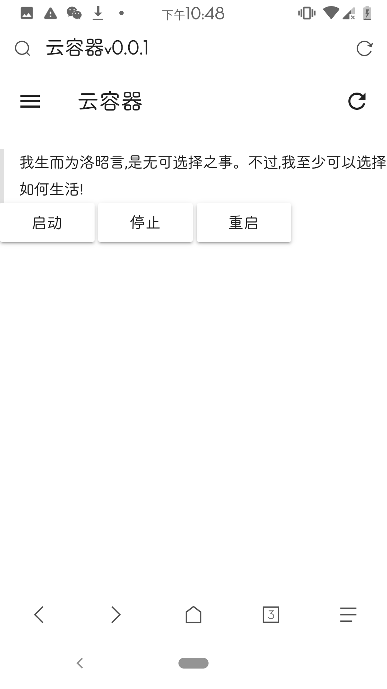
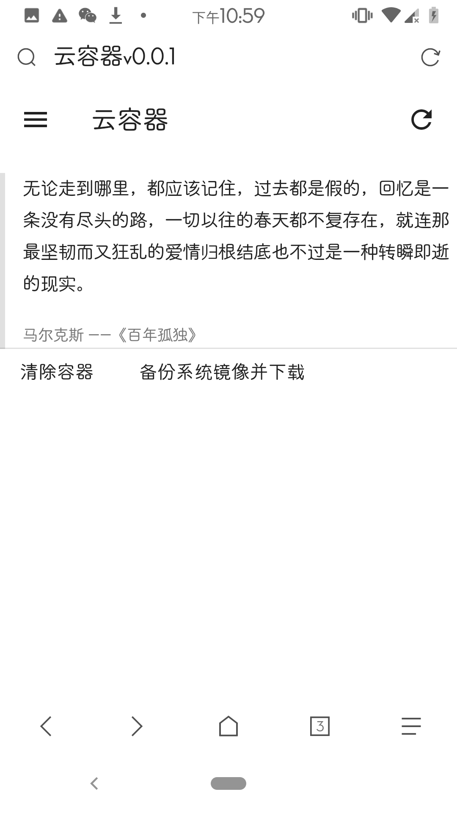
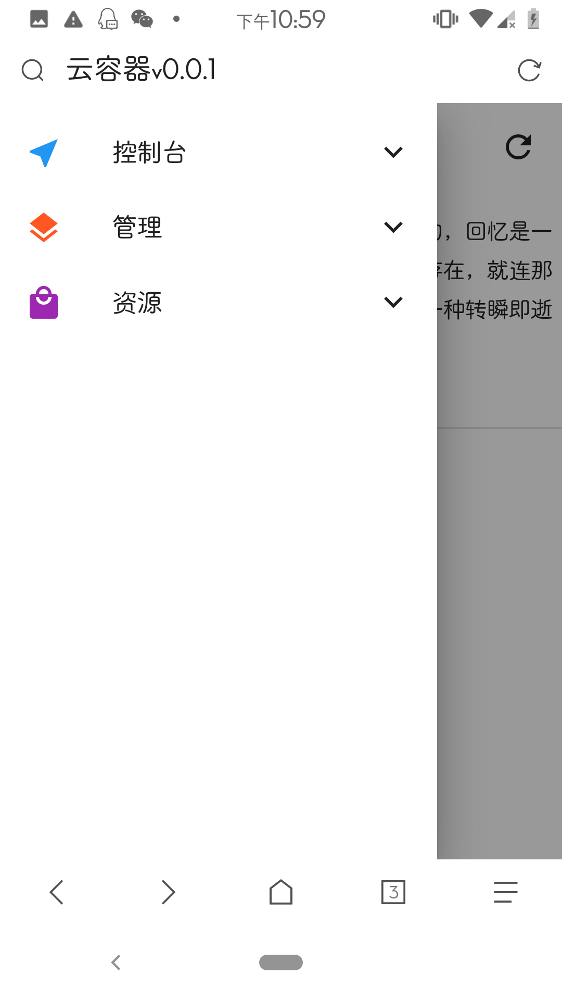
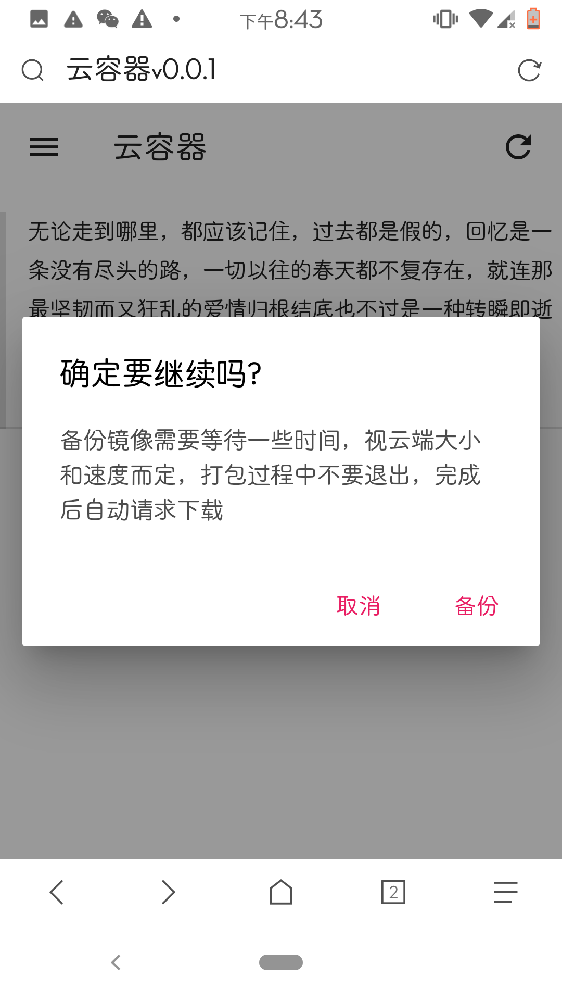
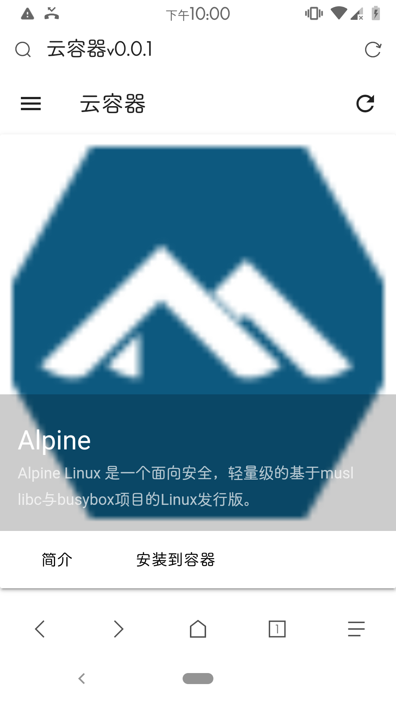
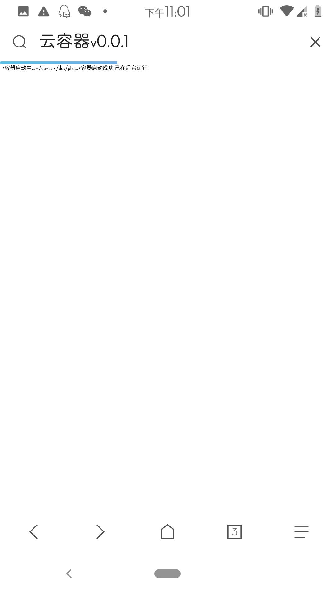

# Cloud Container  
云容器是一基于httpd和chroot的web容器管理器，可以在web上便捷管理各个容器以及启动相关操作，如同开云主机一般。  
轻量级快速简单高效，使用MDUI作为前端框架开发。

---  
用途:  
*在线自用管理服务器容器  
*租借他人  
*批量部署集群  
---   
LICENSE: GPLV3禁止商业化使用  
兼容Linux发行版或Android平台  
相关依赖: httpd(busybox),chroot(busybox/coreutils),sh  
---  
警告:  
目前仍在开发状态，部分功能尚未完全。 
对于使用本组件造成服务器被攻击或数据泄露丢失不负任何责任   